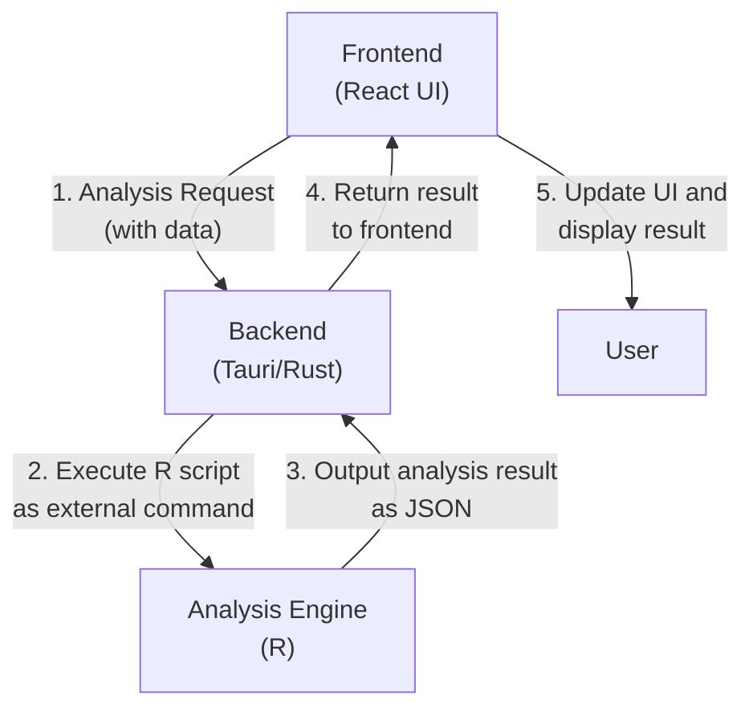

# Architecture Document

本アプリケーションは、Tauriフレームワークを基盤とし、フロントエンド、バックエンド、そして統計分析エンジンを明確に分離したアーキテクチャを採用しています。

## 概要

ユーザーインターフェース（UI）はReact、アプリケーションのコアロジック（バックエンド）はRust、そして高度な統計分析はR言語が担当します。これにより、各技術の長所を最大限に活用します。

- **フロントエンド (React):** インタラクティブでモダンなUIを提供。
- **バックエンド (Rust):** 安全で高速な処理と、OSとの連携を担当。
- **分析エンジン (R):** 豊富で強力な統計分析機能を提供。

## データフロー

ユーザーの操作から分析結果が表示されるまでのデータの流れは以下の通りです。

## 処理のステップ

1.  **UI操作:** ユーザーがフロントエンド（React）の画面上でボタンをクリックするなどして、分析を要求します。
2.  **Tauriコマンド呼び出し:** ReactはTauriの`invoke` APIを使い、分析に必要なデータを引数としてバックエンドのRust関数（Tauriコマンド）を呼び出します。
3.  **Rスクリプト実行:** Rustは受け取ったデータを整形し、`Rscript`コマンドを介して外部のRスクリプトを呼び出します。このとき、データはコマンドライン引数としてRスクリプトに渡されます。
4.  **統計分析:** Rスクリプトはデータを受け取り、統計分析を実行します。分析が完了すると、結果をJSON形式の文字列として標準出力に出力します。
5.  **結果の返却:** RustはRスクリプトの標準出力をキャプチャし、その内容（JSON文字列）をフロントエンドに返します。
6.  **結果の表示:** ReactはRustから受け取った分析結果をパースし、画面の表示を更新してユーザーに結果を提示します。

このアーキテクチャにより、UIの応答性を保ちながら、バックグラウンドで重量級の統計処理を安全かつ効率的に実行することが可能になります。

## ランタイム要件

- R本体の導入
  - macOSでは `brew install r` によるインストールで十分。
- Rパッケージ
  - JSON入出力用に `jsonlite` のみを使用。
  - 再現性確保のため `renv` を採用。`renv.lock` を管理し、初回起動時に `renv::restore()` を実行する。
- 実行ポリシー
  - Rスクリプトは `Rscript --vanilla` で実行し、ユーザーの `.Rprofile` や環境設定の影響を避ける。
  - ロケール固定（例: 環境変数 `LANG=C`）や小数点記号など環境差異の影響を最小化する。
  - 必要に応じて標準出力/標準エラーを分離し、Rust側で個別に処理できるようにする。

## データ連携の契約（I/O仕様）

- 入力データ
  - Rust側でUIの表データ（`ParsedTable`）をRが消化しやすいJSON形式に変換する。
  - JSONファイル経由で渡す。ファイルは一時ディレクトリに保存し、そのパスを引数としてRに渡す。
- 出力データ
  - R側は標準出力にJSONで返す。
  - 欠損値は `na="null"` としてJSONの `null` に統一する。
- 型・前処理
  - `src-r/R/describe.R` は数値列を前提とする。
  - Rust側で数値列バリデーションや型変換を実施（非数値の除外/変換）。
  - 列名補完や空値処理はExcel取り込み時の補完方針と整合させる。
