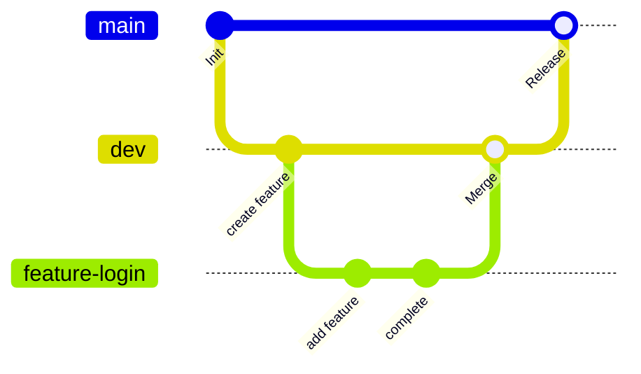

# 開発者向けドキュメント

このドキュメントは**ベータ版開発中**の内容を反映しています。**内容が大きく変更される可能性があります**。

## Git

### ブランチ戦略

<table>
  <tr>
    <th>ブランチ</th>
    <th>説明</th>
  </tr>
  <tr>
    <td><code>main</code></td>
    <td>
      原則として直接の編集はしない<br>
      実際に稼働させるコードを保管するブランチ
    </td>
  </tr>
  <tr>
    <td><code>dev</code></td>
    <td>
      開発時の集約先となるブランチ
      <ul>
        <li><code>main</code> から派生させる</li>
        <li>beta 版開発中は<code>dev-beta</code> を使用</li>
      </ul>
    </td>
  </tr>
  <tr>
    <td><code>feature</code></td>
    <td>
      特定の機能や作業で使用するブランチ
      <ul>
        <li><code>dev</code> から派生させる</li>
        <li><code>feature-{name}</code> の形式で作成する</li>
        <li>作業が完了したら <code>dev</code> へマージ</li>
      </ul>
    </td>
  </tr>
</table>



### コミットルール

必ずフォーマッターを実行してから push してください。

```bash
cargo +nightly fmt
```

コミットメッセージは `.github/.gitmessage` にある[テンプレート](https://github.com/stkii/psycdata/blob/main/.github/.gitmessage)に従って作成してください。必要に応じて、以下のコマンドでコミットメッセージ作成時にテンプレートを表示することができます。

```bash
git config commit.template /path/to/.github/.gitmessage

# このとき、`-m`オプションは使用しない
git commit
```

## RStudio (Optional)

`src-r/` の開発において、`RStudio` で作業する場合は以下の手順に従ってください。`RStudio` はインストールされており使用可能であることを前提としています。

- `src-r/` を既存のプロジェクトとして開く
- `renv::status()` で確認
  - `No issues found -- the project is in a consistent state` と出力されればOK

## その他

一部のエディタ設定を `.vscode/` などにバンドルしています。特に、`rust-analyzer` のメモリ消費を抑えるために、proc-macro の展開を無効化するなどの設定をしています。必ず確認し、必要に応じて削除または編集してください。
